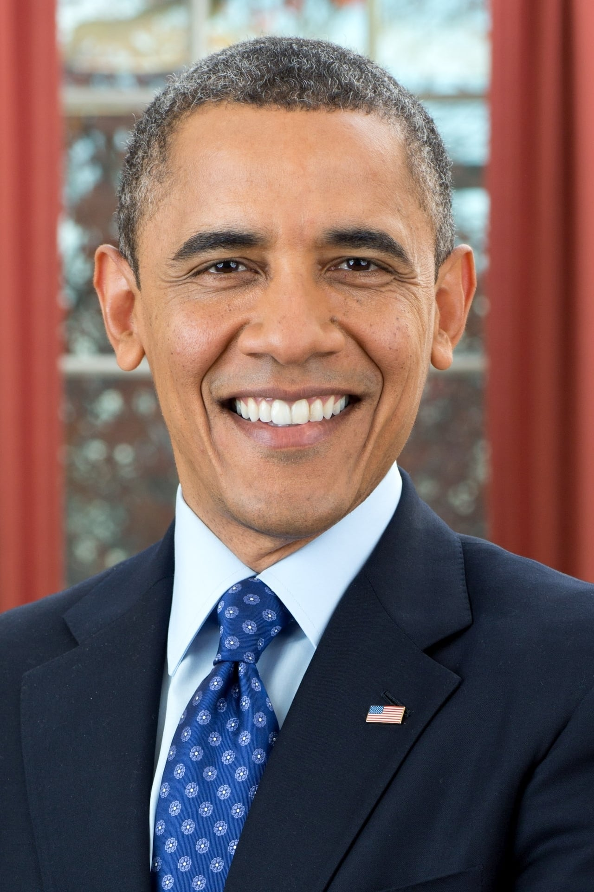
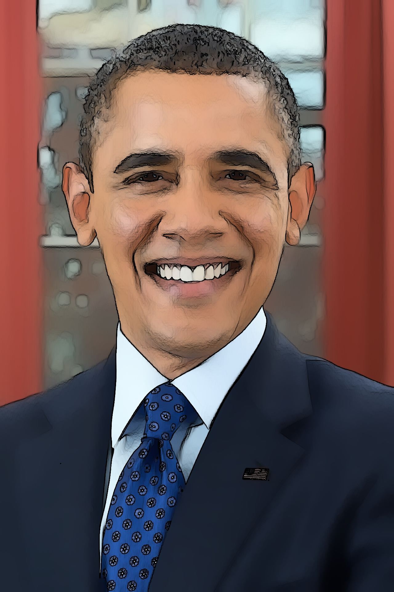
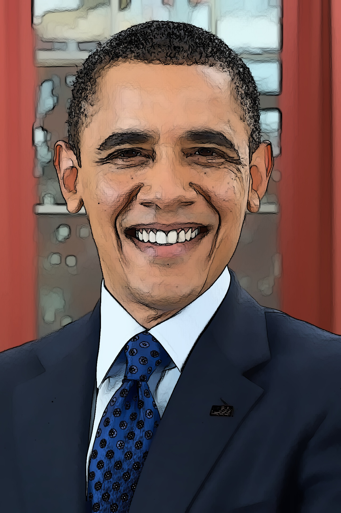

# Image Cartoonization
This script converts a given image to a cartoon using 
*CV2* library.

### Examples




### Running the script
```commandline
python cartoonize.py
```

### Libraries Used
- CV2

### *Author Name*
[Mohamed El Hacen Habib](https://github.com/mohamedelhacen)